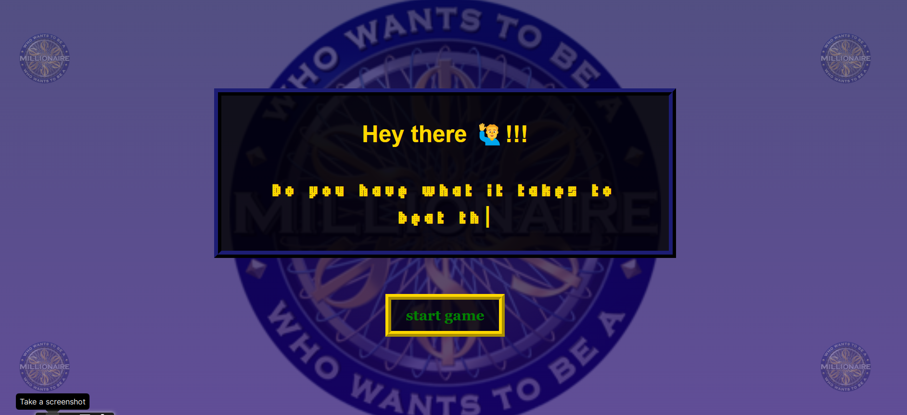
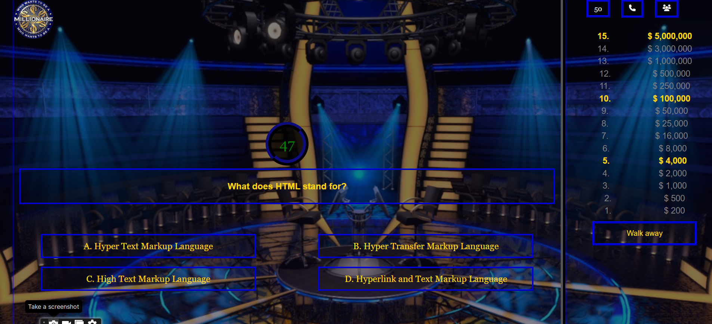

#  Quiz App

This project is to show my proficiency in Html, css and javascript. I structured this quiz project as a "Who Wants to Be a Millionaire" format where users have to correctly answer a series of multiple-choice questions in order to advance to the next level / question. There are 15 questions in total and each question is worth a specific amount of money and a time limit is placed on user to come up with an answer otherwise, you loose the game. Contestants also get three Lifelines to assist them if they get stuck on a particular question.

More updates on the game later .....

#  Deployed to 👇

- Explore [Project Link](https://liljosh-quiz.vercel.app/)

### Features:
- Call a friend
- 50/50
- Ask the audience
- Display Questions and Answers
- Display Amount won
- Display Timer

### Rules of the game:
- Question pops up on every correct answer you choose.
- On every correct answer, you win a certain amount of money and you can choose to walk away anytime.
- If you get any wrong answer before getting to the guaranteed price level, you will go back to the guaranteed price level you have surpassed successfully, however, you wont win anything if eventually you choose the wrong answer at the lowest guaranteed price.
- You can also use lifelines such as 50/50, call a friend, and ask the audience (50/50 deletes two wrong answers, leaving one correct answer and wrong answer for you to choose.)\

- Good lick 😉💖

### Built with
- Html
- Css
- Javascript

## My Social Media

- LinkedIn - [@joshua](https://www.linkedin.com/in/joshua-ehichioya/)
- Twitter - [@liljoshdev](https://x.com/liljoshdev)

#### Screenshot👇

- Start page

- Question page

